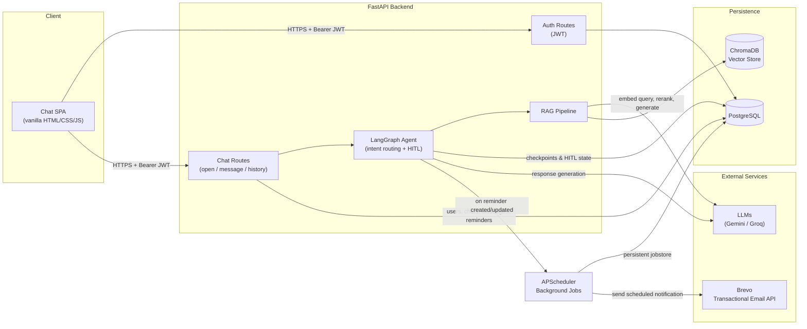
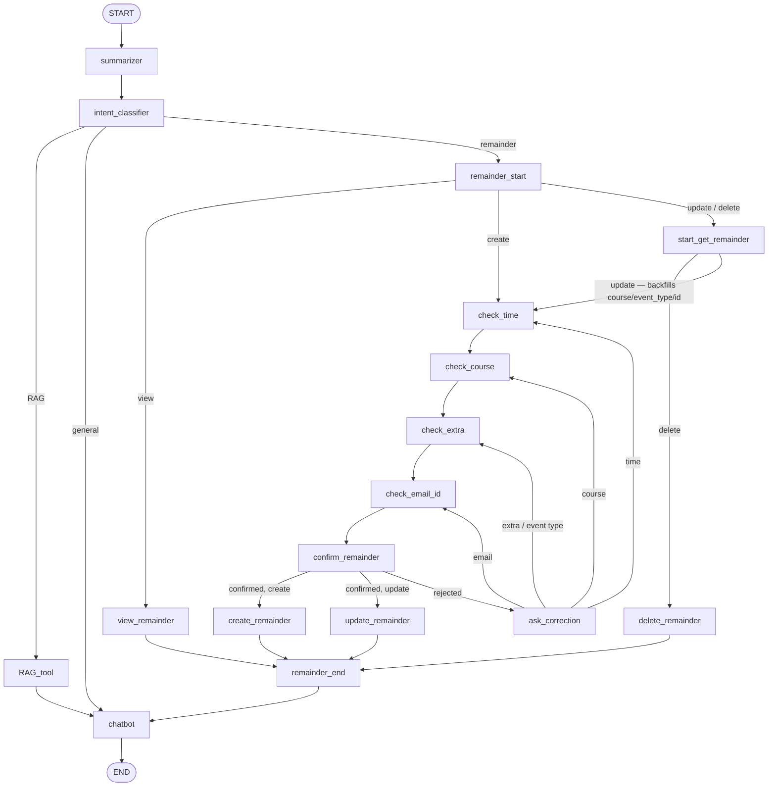

# CampusMind

**An agentic academic assistant for VIT students** — answers questions about institute regulations via Retrieval-Augmented Generation, and manages personal academic reminders through a conversational, human-in-the-loop workflow with email notifications.

Repository: [MONISH-S-0042/CampusMind](https://github.com/MONISH-S-0042/CampusMind)

---

## Table of Contents

- [Overview](#overview)
- [Key Features](#key-features)
- [System Architecture](#system-architecture)
- [The Agent: LangGraph State Machine](#the-agent-langgraph-state-machine)
- [Design Decisions & Rationale](#design-decisions--rationale)
- [RAG Pipeline](#rag-pipeline)
- [Reminder Notification System](#reminder-notification-system)
- [Tech Stack](#tech-stack)
- [Model Specifications](#model-specifications)
- [Data Model](#data-model)
- [Project Structure](#project-structure)
- [Setup & Configuration](#setup--configuration)
- [Known Limitations & Future Work](#known-limitations--future-work)

---

## Overview

CampusMind is a chat-based assistant built for VIT students that handles two distinct classes of requests through a single conversational interface:

1. **Policy Q&A** — questions about attendance rules, hostel policy, examination regulations, etc., answered by retrieving and reasoning over the institute's actual regulation documents (RAG).
2. **Academic reminders** — creating, viewing, updating, and deleting reminders for quizzes, assignments, and classes, delivered via email at three points ahead of the deadline.

A single LLM-driven classifier routes every incoming message to the correct workflow, and the reminder workflow itself is a multi-turn, human-in-the-loop conversation — the agent asks follow-up questions when information is missing, lets the user correct or cancel at any point, and persists its exact conversational state durably, so a multi-step reminder request can be resumed correctly even if the server restarts mid-conversation.

---

## Key Features

- **Retrieval-Augmented Q&A** over VIT regulation documents, with cross-encoder reranking for retrieval precision.
- **Conversational reminder management** (create / view / update / delete) with natural-language date parsing ("day after tomorrow", "next Monday at 5pm").
- **Human-in-the-loop (HITL) workflows** — the agent pauses mid-conversation to ask for missing information (time, course, email) and resumes exactly where it left off, including across server restarts.
- **Cancel and correct at any step** — the user can cancel a reminder operation or go back and correct a specific field at any point in the flow.
- **Durable agent state** — conversation and workflow state is checkpointed to PostgreSQL, not held in memory, so nothing is lost on restart.
- **Rolling conversation summarization** — long conversations are automatically compacted into a running summary to bound LLM context size and cost.
- **Email notifications** for reminders at three intervals (1 day before, 2 hours before, and at the deadline), sent via a background scheduler that itself survives restarts.
- **JWT-based authentication** and a lightweight single-page chat frontend.

---

## System Architecture



PostgreSQL is used for three deliberately distinct purposes at once, not as an accident of convenience — see [Design Decisions](#design-decisions--rationale) below.

---

## The Agent: LangGraph State Machine



**Not shown for clarity:** any `check_*` or `confirm_remainder` node routes directly to `remainder_end` if the user cancels at that point (`"cancel"`, `"stop"`, `"nevermind"`, etc.), short-circuiting the rest of the chain.

**Notable reuse:** `create` and `update` operations share the exact same `check_time → check_course → check_extra → check_email_id → confirm_remainder` chain. For `update`, `start_get_remainder` pre-fills `course_name`, `event_type`, and the target record's ID before entering the chain, so the user is only asked about fields that are genuinely missing or being changed — the chain itself doesn't need to know or care whether it's serving a create or an update.

---

## Design Decisions & Rationale

A few choices in this project were arrived at after hitting real problems during development, not decided upfront — documented here because the *reasoning* is usually more informative than the *choice*.

**LangGraph over a hand-rolled state machine.** The actual justification isn't the branching logic itself — a flat `if/elif` chain does that just as well. It's two specific capabilities LangGraph provides that would be genuinely hard to reimplement: (1) **durable checkpointing** via `PostgresSaver`, so the entire agent state — messages, in-progress reminder data, which node is paused — survives a server restart, and (2) **`interrupt()`/`Command(resume=...)`**, which lets a node pause mid-execution, across a real HTTP request boundary, and resume later exactly where it left off. Both are hard primitives to build correctly by hand.

**Deterministic classify-then-route, not a ReAct/tool-calling agent.** An earlier iteration tried binding tools directly to the LLM and letting it decide when to call them. The model used (a free-tier open-weight model) frequently ignored forced tool-calling and answered in prose instead, causing hard API errors. Classifying intent once, in a single structured-output call, and routing deterministically in Python sidesteps that unreliability entirely — the "does the model do what it's told" risk is confined to one well-tested call site instead of spread across every turn.

**Every node in the reminder chain routes via `Command(goto=...)`, never a static edge.** LangGraph schedules *both* a node's static outgoing edge and a `Command(goto=...)` it returns, if both are present — this caused a real bug where a single user turn produced two simultaneous, conflicting pending interrupts. The fix was consistent: any node that needs conditional or looping control flow (retry on bad input, cancel, correction routing) uses `Command` exclusively, with no static edge defined for it at all.

**An explicit `time_mentioned` boolean, separate from `remainder_time` itself.** Asking a small LLM to "return `null` if no time was given" is not reliable in practice — it will frequently guess a plausible-looking date instead of admitting it doesn't know. Splitting the *decision* ("was a time mentioned at all?") from the *value* ("what is it?") into two separate schema fields makes the null-check enforceable in code, regardless of what the model does with the second field.

**`classify_intent` reads only the last two messages plus a rolling summary — not full history.** Early versions passed the entire conversation to the classifier, which caused old, unrelated reminder requests to "leak" into the classification of a completely new message (e.g., an unrelated RAG question inheriting a course name and date from three turns earlier). Deliberately narrowing what the classifier can see is what actually fixed this — prompt instructions alone did not reliably prevent it.

**`remainder_end` is a single funnel node that resets all transient state.** `remainder_data` uses a shallow-merge reducer, which only overwrites keys present in a given update — it never clears keys that are simply absent. Internal, per-request fields (`update_id`, `delete_ids`, `retry_message`, `change_email`) would otherwise silently persist across unrelated future turns. Every exit from the reminder sub-graph — success, cancellation, or error — passes through `remainder_end` specifically to close this leak in one place rather than at every exit point individually.

**The final `chatbot` node treats reminder confirmations and RAG/general answers differently on purpose.** For a completed reminder operation, the exact, already-correct confirmation string is passed straight through to the user unmodified — it is deliberately *not* rephrased by the LLM, since an LLM paraphrasing a date or time risks silently altering it. For RAG and general conversation, by contrast, the LLM *is* used to turn retrieved context into a natural response, since faithfulness to phrasing matters far less there than fluency.

**PostgreSQL serves three genuinely separate purposes, not by accident:** (1) application tables (`users`, `chats`, `messages`, `remainders`) for user-facing data, (2) LangGraph's own checkpoint tables (via `PostgresSaver`) for durable agent/HITL state, and (3) APScheduler's job store, so scheduled reminder notifications survive a server restart too. All three happen to live in the same database, but each is a distinct system reading and writing its own tables.

**Email over SMS or WhatsApp for notifications.** SMS delivery to Indian numbers requires DLT (carrier-level sender/template registration under TRAI regulation) — a real compliance barrier, not just a cost one. WhatsApp's Business API requires Meta business verification and pre-approved message templates for any proactive (non-reply) message. A personal Gmail SMTP account was tried and suspended by Google's automated-abuse detection after repeated scripted login attempts during development. A transactional email API (Brevo) was chosen specifically because programmatic sending is its intended use case, not an edge case it has to defend against.

---

## RAG Pipeline

```
PDF / TXT documents
      │
      ▼
Document Loader  ──── PyMuPDFLoader (native-text PDFs)
      │                TextLoader   (image-based PDFs, pre-converted to .txt)
      ▼
RecursiveCharacterTextSplitter
      (chunk_size=600, chunk_overlap=200)
      │
      ▼
Embedding Manager ── SentenceTransformer (google/embeddinggemma-300m)
      │
      ▼
ChromaDB (persistent, cosine similarity) ── top-30 candidates
      │
      ▼
Cross-Encoder Reranker (BAAI/bge-reranker-base) ── top-5 by relevance
      │
      ▼
LLM (context-grounded answer, strict "answer only from context" prompt)
```

**A concrete lesson from development:** a subset of the source PDFs were scanned/image-based, meaning direct PDF text extraction (`PyMuPDFLoader`) returned garbled or empty content for them, which quietly degraded retrieval quality without an obvious error. The fix was converting those specific documents to clean `.txt` sources and adding a parallel `TextLoader` ingestion path — worth knowing about if retrieval quality unexpectedly plateaus despite a seemingly correct pipeline.

**Retrieval is two-staged deliberately:** ChromaDB's vector search retrieves a wide candidate set (top-30) using fast cosine similarity, then the cross-encoder reranker — which jointly encodes the query and each candidate, rather than comparing independent vectors — re-scores and narrows to the final top-5 passed to the LLM. This trades some latency for meaningfully better precision on the documents that actually reach the generation step.

**Documents are ingested idempotently.** A `Document` table tracks every file already ingested by its file path, so re-running ingestion against the same data directory skips files already processed rather than duplicating them in the vector store.

---

## Reminder Notification System

Each reminder schedules three separate background jobs via APScheduler at creation or update time:

| Trigger | Timing |
|---|---|
| `before_1_day` | 24 hours before the reminder time |
| `before_2_hours` | 2 hours before the reminder time |
| `at_time` | At the reminder time itself |

- Jobs use a **SQLAlchemy-backed job store**, so scheduled notifications persist across server restarts — a job scheduled today for three days from now will still fire even if the server is redeployed in the meantime.
- Each send attempt retries up to 3 times; the reminder's `status` field records the outcome (`{stage}_sent` / `{stage}_failed`) for observability.
- A reminder is marked `is_active = False` only once its final (`at_time`) notification succeeds — earlier stages failing doesn't deactivate it, since later stages should still get a chance to fire.
- Updating a reminder's time reschedules all three jobs (`replace_existing=True`); deleting one explicitly unschedules all three, rather than relying on them to simply fail against a missing record later.

---

## Tech Stack

| Layer | Technology |
|---|---|
| Backend framework | FastAPI |
| Agent orchestration | LangGraph (`StateGraph`, `interrupt`/`Command`, `PostgresSaver`) |
| LLM orchestration | LangChain (`init_chat_model`, structured output) |
| LLM providers | Google Gemini, Groq (swappable per role via env config) |
| Vector store | ChromaDB (persistent, cosine similarity) |
| Embeddings | Sentence Transformers |
| Reranking | Sentence Transformers `CrossEncoder` |
| PDF/text ingestion | PyMuPDF, LangChain document loaders, `RecursiveCharacterTextSplitter` |
| Relational database | PostgreSQL (application data, LangGraph checkpoints, job store) |
| ORM | SQLAlchemy |
| Background scheduling | APScheduler (`BackgroundScheduler`, `SQLAlchemyJobStore`) |
| Natural-language date parsing | `dateparser` |
| Authentication | JWT (`python-jose`), `pwdlib` password hashing |
| Email delivery | Brevo transactional email API |
| Frontend | Vanilla HTML / CSS / JavaScript (single-page, no build step), `marked` + `DOMPurify` for safe markdown rendering |

---

## Model Specifications

| Model | Role | Type | Output |
|---|---|---|---|
| `google/embeddinggemma-300m` | Document & query embeddings | Sentence Transformer (Gemma 3 backbone) | 768-dimensional dense vector (Matryoshka-truncatable to 512 / 256 / 128) |
| `BAAI/bge-reranker-base` | Reranking retrieved candidates | Cross-encoder (XLM-RoBERTa-base backbone) | Single relevance score per (query, passage) pair — not an embedding |
| Intent classifier LLM | Structured intent + slot extraction | Configurable via `INTENT_LLM` | JSON (`json_mode`) |
| Chat/response LLM | RAG answer synthesis, general conversation | Configurable via `CHATBOT_LLM` | Natural language |

Both `google/embeddinggemma-300m` (300M parameters, 100+ language support, 2048-token max input) and `BAAI/bge-reranker-base` (512-token max sequence length) run locally via `sentence-transformers`, decoupling retrieval quality from any single LLM provider's availability or rate limits.

---

## Data Model

Core tables (see `app/db/models.py` for full definitions):

- **`User`** — credentials (hashed password), and `mobile_number`/`email_id` collected on first reminder creation.
- **`Chat`** — one active chat thread per user, created lazily on first open.
- **`Message`** — full conversation history (`role`, `content`, `created_at`), paginated via cursor-based `before_id`/`limit` query parameters for lazy-loading in the frontend.
- **`Remainder`** — `course_name`, `remainder_time` (timezone-aware), `event_type`, `extra_info`, `status`, `is_active`, linked to `user_id`.
- **`Document`** — ingestion log for the RAG pipeline, tracking which source files have already been processed.

---

## Project Structure

```
app/
├── RAG/
│   └── operations/
│       ├── data_ingestion.py       # Orchestrates the ingestion pipeline
│       ├── document_loader.py      # PDF/TXT loading + chunking
│       ├── embedding_manager.py    # SentenceTransformer wrapper
│       ├── vectore_store.py        # ChromaDB wrapper
│       ├── rag_retriver.py         # Vector search + reranking
│       └── retrival_pipeline.py    # Prompt construction + LLM call
├── services/
│   ├── graph.py                    # LangGraph graph assembly & invocation entrypoint
│   ├── langgraph_model.py          # State / schema definitions
│   ├── core_nodes/                 # Intent classification, RAG tool, summarizer, chatbot
│   ├── remainder/                  # Full reminder sub-graph (create/view/update/delete, HITL)
│   ├── notification/               # Email sending + APScheduler wiring
│   ├── authentication/             # JWT issuing/verification
│   ├── chat/                       # Chat open/message/history routes
│   └── utilities/                  # Timezone helpers, cancel-handling helpers
└── db/
    ├── models.py                   # SQLAlchemy models
    └── database.py                 # Engine/session setup
```

---

## Setup & Configuration

### Environment variables

```env
DATABASE_URL=postgresql://<user>:<password>@localhost:5432/campusmind

GOOGLE_API_KEY=<gemini api key>
GROQ_API_KEY=<groq api key>
INTENT_LLM=<provider:model-string, e.g. groq:openai/gpt-oss-120b>
CHATBOT_LLM=<provider:model-string, e.g. google_genai:gemini-3.5-flash-lite>

BREVO_API_KEY=<brevo api key>
BREVO_SENDER_EMAIL=<verified sender address>
BREVO_URL=https://api.brevo.com/v3/smtp/email
```

> **Security note:** the JWT signing secret is currently a hardcoded constant in `auth.py`. Before any real deployment, move it to an environment variable and generate a strong random value.

### Running locally

1. Install dependencies (`pip install -r requirements.txt`).
2. Set up a PostgreSQL database and populate `.env` as above.
3. Place source regulation documents (PDF or pre-converted `.txt` for scanned files) in the RAG data directory, then run the ingestion pipeline once to populate the vector store.
4. Start the FastAPI app — this also initializes the LangGraph checkpointer and starts the background scheduler.
5. Open the frontend chat client (`campusmind.html`), pointed at your running backend's URL.

---

## Known Limitations & Future Work

- **Compound requests** ("remind me about X and also tell me Y") are not currently split into multiple handled intents in one turn — each message is treated as a single request. A `Send`-based fan-out design was scoped for this but not yet implemented, deliberately deferred in favor of getting single-intent handling fully reliable first.
- **No formal retrieval evaluation harness yet** — retrieval/reranking quality has been assessed manually so far; an LLM-as-judge evaluation script against a fixed question set is a natural next addition.
- **No caching layer** — repeated, near-identical RAG questions currently re-run the full retrieval + generation pipeline each time; a Redis cache keyed on the query is a reasonable, well-scoped addition.
- **Not containerized yet** — a `Dockerfile` and `docker-compose.yml` (app + Postgres) would make setup reproducible without manual environment configuration.
- **Retry loops in the reminder flow have no hard attempt cap** — a user repeatedly giving unparseable input could loop indefinitely; a max-retry fallback (e.g., "let's skip this for now") is a reasonable hardening step.
